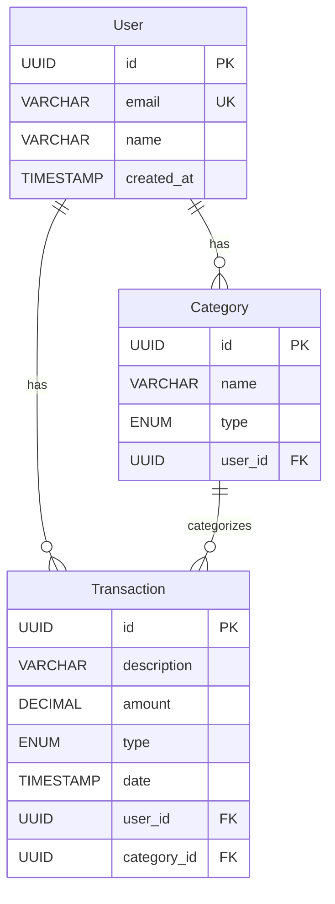

# Diagrama Entidade Relacionamento - Gerenciador Financeiro

## Entidades

### Transaction (Transação)
- **id** (UUID) - Chave primária
- **description** (VARCHAR) - Descrição da transação
- **amount** (DECIMAL) - Valor da transação
- **type** (ENUM) - Tipo da transação ('income' | 'expense')
- **category** (VARCHAR) - Categoria da transação
- **date** (TIMESTAMP) - Data da transação
- **user_id** (UUID) - Chave estrangeira referenciando User

### User (Usuário)
- **id** (UUID) - Chave primária
- **email** (VARCHAR) - Email do usuário (único)
- **name** (VARCHAR) - Nome do usuário
- **created_at** (TIMESTAMP) - Data de criação

### Category (Categoria)
- **id** (UUID) - Chave primária
- **name** (VARCHAR) - Nome da categoria
- **type** (ENUM) - Tipo da categoria ('income' | 'expense')
- **user_id** (UUID) - Chave estrangeira referenciando User

## Relacionamentos

1. User -> Transaction (1:N)
   - Um usuário pode ter várias transações
   - Cada transação pertence a um único usuário

2. User -> Category (1:N)
   - Um usuário pode ter várias categorias
   - Cada categoria pertence a um único usuário

3. Category -> Transaction (1:N)
   - Uma categoria pode estar em várias transações
   - Cada transação pertence a uma única categoria

## Diagrama

## Restrições

### User
- Email deve ser único
- Email não pode ser nulo
- Nome não pode ser nulo

### Transaction
- Valor deve ser maior que zero
- Descrição não pode ser nula
- Tipo deve ser 'income' ou 'expense'
- Data não pode ser nula
- Referência ao usuário não pode ser nula
- Referência à categoria não pode ser nula

### Category
- Nome não pode ser nulo
- Tipo deve ser 'income' ou 'expense'
- Referência ao usuário não pode ser nula

## Índices

### User
- Índice primário: id
- Índice único: email

### Transaction
- Índice primário: id
- Índice composto: (user_id, date)
- Índice: category_id

### Category
- Índice primário: id
- Índice composto: (user_id, name)

## Observações

1. Todas as chaves primárias utilizam UUID para melhor distribuição e segurança

2. Timestamps são automaticamente gerenciados pelo banco de dados

3. As enumerações (ENUM) garantem integridade dos tipos de transação e categoria

4. Os relacionamentos são mantidos através de chaves estrangeiras com integridade referencial

5. Índices compostos otimizam consultas comuns como:
   - Busca de transações por usuário e período
   - Busca de categorias por usuário