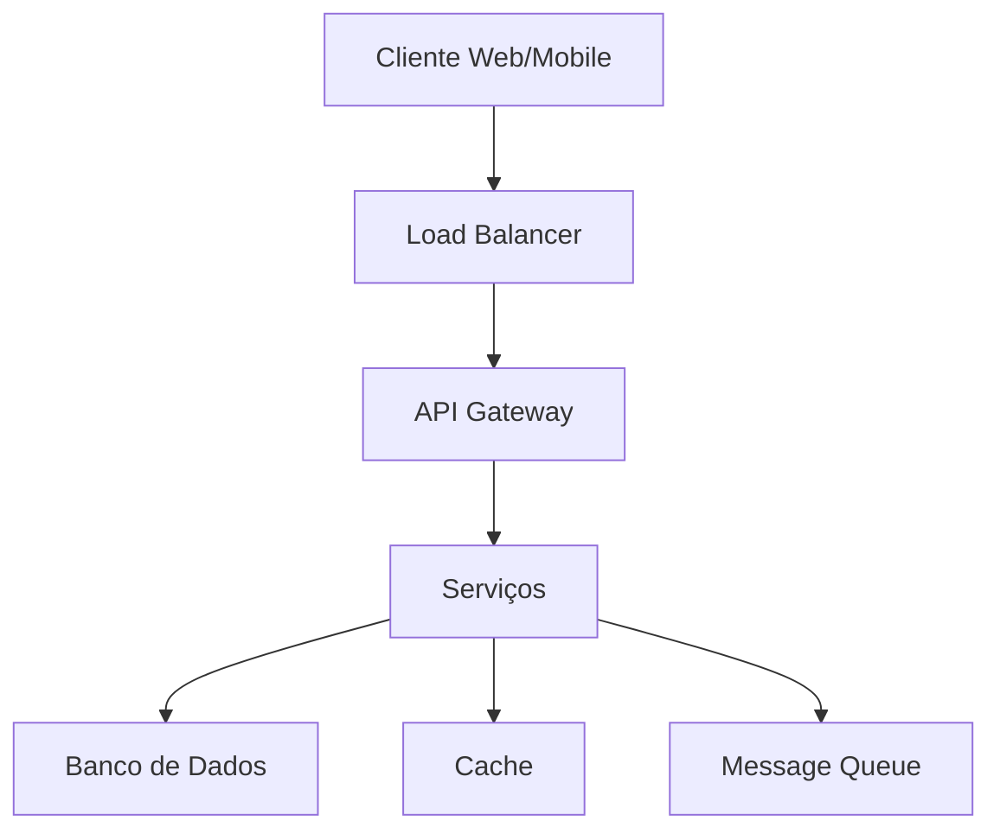

# Arquitetura do Sistema

## Visão Geral

O FinFlow foi construído com uma arquitetura moderna e escalável, focada em performance e segurança.

## Componentes Principais

### Frontend (React + TypeScript)

- **Componentes Reutilizáveis**
  - Design System próprio
  - Componentes atômicos
  - Temas customizáveis

- **Estado Global**
  - Gerenciamento eficiente
  - Cache local
  - Sincronização em tempo real

### Backend (Supabase)

- **Banco de Dados**
  - PostgreSQL
  - Row Level Security
  - Triggers e Functions
  - Backup automático

- **Autenticação**
  - JWT
  - 2FA
  - SSO Enterprise
  - Audit logs

### Infraestrutura

- **Escalabilidade**
  - Auto-scaling
  - Load balancing
  - CDN global
  - Edge computing

- **Monitoramento**
  - Logs centralizados
  - Métricas em tempo real
  - Alertas automáticos
  - APM integrado

## Segurança

### Camadas de Proteção

1. **Frontend**
   - HTTPS
   - CSP
   - CORS
   - XSS Protection

2. **API**
   - Rate limiting
   - Input validation
   - Output sanitization
   - API keys

3. **Dados**
   - Encryption at rest
   - Encryption in transit
   - Key rotation
   - Data masking

## Performance

### Otimizações

- **Frontend**
  - Code splitting
  - Lazy loading
  - Service Workers
  - Cache strategies

- **Backend**
  - Query optimization
  - Connection pooling
  - Caching layers
  - Async processing

### Métricas

- Time to First Byte: < 100ms
- First Contentful Paint: < 1s
- Time to Interactive: < 2s
- Lighthouse Score: > 90

## Escalabilidade

### Horizontal

- Containerização
- Orquestração
- Service mesh
- Multi-region

### Vertical

- Resource optimization
- Memory management
- CPU utilization
- I/O handling

## Disaster Recovery

### Estratégias

1. **Backup**
   - Snapshots diários
   - Replicação contínua
   - Geo-redundância
   - Retention policy

2. **Recovery**
   - RTO < 1 hora
   - RPO < 5 minutos
   - Failover automático
   - Rollback capability

## Integração Contínua

### Pipeline

## Monitoramento

### Métricas Chave

- Uptime: 99.99%
- Error rate: < 0.1%
- Response time: < 100ms
- CPU usage: < 70%

### Alertas

- Threshold-based
- Anomaly detection
- Predictive analytics
- Incident management

## Conclusão

A arquitetura do FinFlow foi projetada para atender às necessidades mais exigentes do mercado empresarial, garantindo segurança, performance e escalabilidade.